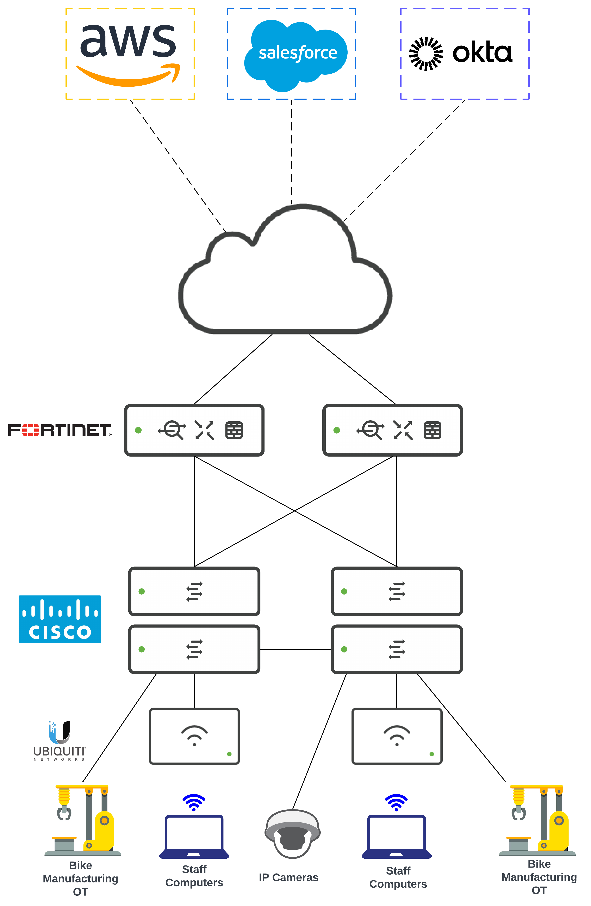

---
## What We Do

We are a "Manufacturing as a Service" company that provides manufacturing centers for independent bike makers. 

Our facilities contain the most state of the art bike manufacturing equipment, office and storage space, and on-site staff for infrastructure maintenance and security (IT and physical).

We are flexible with our leasing prices and even offer month to month options if needed.

## Our Current Network

- Each site has a relatively flat network. We reserve switchports for Bike manufacturing OT equipment, building security, printers, and some local NAS servers. 

- We mostly use cloud resources:
    
    - AWS for developer resources.

    - Salesforce acts as our CRM.

    - Okta for our Identity Mangement Platform.

- We use networking hardware from three different vendors and do not have a centralized dashboard to manage the hardware. 

    - FortiGate firewalls for routing and security

    - Cisco Catalyst 9200 switches

    - Ubiquiti WAPs

## Business and IT Requirements

- Biketopolis does not have a centralized asset tracking platform for IT and OT equipment. We are considering a CAASM that can find and organize our assets, but also identify potential vulnerabilities.

- IT leadership is considering an MDM solution, but not all devices can accommodate an agent or management profile for full management. It would be nice to have an asset tracking system that can track our unmanaged devices.

- Some of our customers bring in their own network attached devices and we're concerned that the devices use unsecure ports. 

- We would like a platform that can give us a topological view of our network.

- We would like a UI that can give us an easy view of subnet utilization. We are currently using command line. 

- Members of IT and Operations leadership would like a centralized assurance platform to track assets and potential vulnerabilities.

- Need this platform to be able to integrate with other cloud based services. Planning to migrate to Meraki to consolidate full networking stack to a single vendor. 

- We would like a solution with an open API that would allow our developers to make use of the gathered telemetry to be ingested by other 3rd party proprietary or analytics platforms. 

- We also need the ability to configure SAML authentication to the application.

