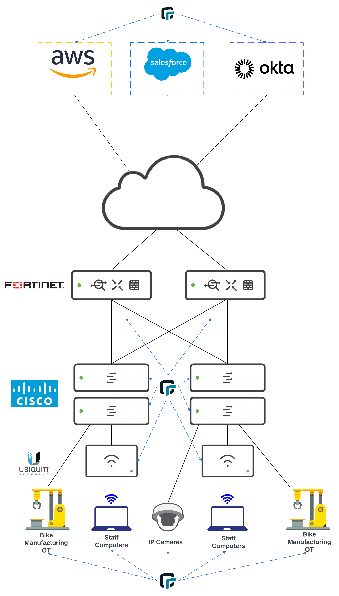

## How RunZero can help Biketopolis

1. RunZero begins with a <a href = "https://help.runzero.com/docs/discovering-assets"> Discovery Scan </a>, which finds, identifies, and builds an inventory of all the connected devices and assets on your internal network. The runZero Explorer and scanner perform unauthenticated active scanning, which provides visibility into assets without the need to install an agent or managed profile.

2. The <a href = "https://console.runzero.com/inventory"> Inventory > Assets </a>  menu provides an easy to navigate through connected assets.

3. The <a href = "https://console.runzero.com/inventory/services"> Inventory > Services </a> menu sorts assets by the Layer 4 ports being used.

4. The <a href ="https://console.runzero.com/reports"> Reports </a> menu provides an Layer 2 Switch Topology view.

5. The <a href ="https://console.runzero.com/data-sources/integrate"> Integrate </a> menu provides a list of service providers that RunZero partners with for integration. For example, you can integrate directly with AWS to identify workloads in your VPCs.

6. RunZero even has an <a href = "https://app.swaggerhub.com/apis/runZero/runZero/"> interactive index</a> of API endpoints that can be used if data needs to be sent to a service provider app not available in the integrate menu.